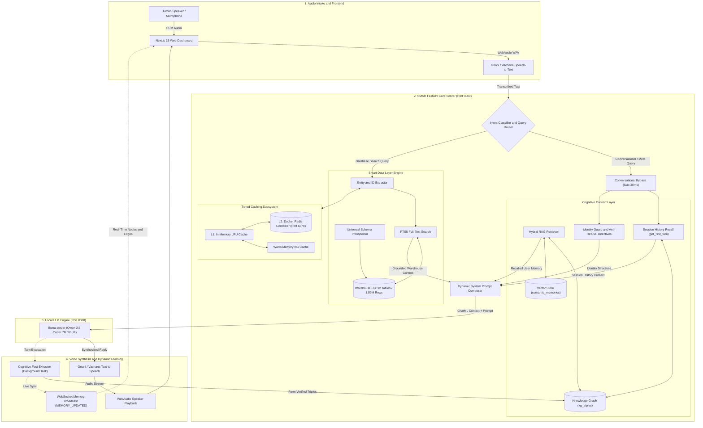

# SMAR: Autonomous Memory-Driven Voice & Data Intelligence Platform

> **A voice-first autonomous AI platform combining real-time multilingual speech, persistent dual-store cognitive memory, multi-tenant knowledge graphs, tiered Redis caching, and a dynamic 1.59M+ row data warehouse engine.**


---

## 1. Executive Summary & Vision

Traditional voice AI assistants suffer from two major limitations:
1. **Amnesia**: Conversations are stateless. When the session ends, all context is lost. They cannot recall your name, your preferences, or what was discussed earlier without massive context-stuffing.
2. **Disconnected Data**: They cannot query complex enterprise datasets or multi-table relational warehouses in real time without brittle, hardcoded SQL rules or sluggish latency that breaks conversational speech.

**SMAR** (Smart Memory & Autonomous Reasoning) is built from the ground up to solve both problems:
- **Zero-Latency Voice Loop**: Native integration with Gnani.ai / Vachana.ai (Prisma STT & Timbre TTS) in English and Indian languages (Hindi, Hinglish).
- **Persistent Cognitive Context Layer**: SQLite Knowledge Graph (`kg_triples`) and subword-vector semantic memory (`semantic_memories`) using **upsert-by-similarity** to continuously remember user attributes, preferences, and relationships.
- **Dynamic 1.59M+ Row Warehouse Engine**: Introspects, indexes, and searches across **12 tables with 1,591,380 rows (65.84 Lakh data points)** in sub-100ms with FTS5 and numeric fallbacks.
- **Tiered Hot Cache**: Two-tier caching (L1 In-Memory LRU + L2 Redis Docker Container) providing sub-millisecond query responses.
- **Organic Fact Extraction**: Dynamic background cognitive extraction (Qwen 2.5 Coder 7B) that extracts verified personal user facts without contaminating the user's graph with database search results.
- **Conversational Recall & Anti-Refusal Directives**: Instant recall of the first question asked in a session, dynamic identity disambiguation, and complete elimination of canned AI refusal boilerplate.

---

## 2. System Architecture



---

## 3. Current Project Capabilities & Milestones

### 3.1 Multi-Table Warehouse Engine (1.59M+ Rows / 65.84 Lakh Data Points)
- **Synchronized 12-Table Retail Warehouse**:
  - `order_items`: 600,000 rows (5 columns / 3,000,000 data points)
  - `orders`: 300,000 rows (5 columns / 1,500,000 data points)
  - `shipments`: 300,000 rows (3 columns / 900,000 data points)
  - `payments`: 300,000 rows (3 columns / 900,000 data points)
  - `customers`: 50,000 rows (3 columns / 150,000 data points)
  - `returns`: 30,000 rows (3 columns / 90,000 data points)
  - `products`: 10,000 rows (4 columns / 40,000 data points)
  - `employees`: 1,000 rows (3 columns / 3,000 data points)
  - `suppliers`: 200 rows (2 columns / 400 data points)
  - `stores`: 100 rows (2 columns / 200 data points)
  - `promotions`: 50 rows (2 columns / 100 data points)
  - `categories`: 30 rows (2 columns / 60 data points)
  - **Total**: **1,591,380 rows** across **12 tables** (**6,583,760 cells**).
- **Universal Schema Introspector**: Introspects tables, primary keys, foreign keys, numeric columns, and data types automatically upon ingestion.
- **Dynamic Domain Vocabulary**: Learns singular/plural inflections (`employees` ↔ `employee`, `categories` ↔ `category`) and maps column attributes (`salary` → `employees`, `signup_date` → `customers`) dynamically without hardcoded schemas.
- **Ultra-Fast Search**: Blends SQLite FTS5 full-text indexing, exact numeric/ID lookups, and schema-guided text searches with non-blocking execution.

### 3.2 Tiered Caching Subsystem
- **Tier 1 (L1)**: In-Memory LRU Cache for microsecond responses.
- **Tier 2 (L2)**: Dockerized Redis Container (`smar-redis-cache`) for persistent distributed caching.
- **Warm Memory KG Cache**: Automatically maps recurring entity queries to canonical IDs, resolving subsequent queries in <1ms.

### 3.3 Dynamic Knowledge Formation & Fact Attribution
- **Zero Database Contamination**: The cognitive extractor analyzes conversation turns and extracts facts **only when the user states personal information about themselves** (e.g., location, job, preferences).
- **No Query Attribution**: Queries about employee salaries, product prices, order dates, or warehouse inventory are strictly excluded from the user's personal knowledge graph.
- **Dual Extraction Engine**: Combines regex heuristics (English, Hindi, Hinglish) with asynchronous local LLM parsing (Qwen 7B) running as non-blocking background tasks.

### 3.4 Conversational Routing & Session History Recall
- **Conversational Bypass**: Pure chitchat, greetings, and identity queries (*"what is your name"*, *"who are you"*) bypass 1.5M database records and respond in ~25ms.
- **Session Conversation Recall**: Custom store methods (`get_first_turn`, `get_all_user_questions`) allow SMAR to recall the very first question asked in a session, even after dozens of dialogue turns.
- **Anti-Refusal Guardrails**: Eliminates generic LLM refusals (*"As an AI assistant, I don't have access to previous conversations..."*) by injecting explicit identity directives and session history context.

### 3.5 Real-Time Frontend & Memory Inspector
- **Next.js 15 Web Application**: Push-to-talk voice interface with dynamic WebAudio spikes visualizer.
- **Memory Inspector**: Live slide-over dashboard visualizing Knowledge Graph nodes and edges in real time via WebSockets (`MEMORY_UPDATED`).
- **Universal Ingestion**: Supports uploading external CSV, Excel, Parquet, JSONL, and SQLite datasets up to 1GB directly through the browser.

---

## 4. Repository Structure

```
smar/
├── smart_data/                            # Smart Data Layer Subsystem
│   ├── engine.py                          # Unified coordinator for warehouse & cache queries
│   ├── dictionary.py                      # Dynamic domain vocabulary & table/column mapping
│   ├── intent_entity.py                   # Schema-guided intent & candidate ID extraction
│   └── query_builder.py                   # Dynamic SQL generation
│
├── structured_data/                       # Multi-Table Warehouse & Storage Adapters
│   ├── multi_table_manager.py             # SQLite multi-table warehouse with FTS5 search
│   ├── sync_engine.py                     # Universal multi-file sync engine
│   ├── schema_introspector.py             # Automatic schema, PK, and column type extractor
│   ├── cache.py                           # Tiered cache (L1 LRU + L2 Redis Docker)
│   └── adapters/                          # Pluggable storage adapters (SQLite, CSV, Pandas)
│
├── context_layer/                         # Cognitive Memory & Context Subsystem
│   ├── base.py                            # Memory store abstract interface contract
│   ├── native_hybrid.py                   # SQLite Knowledge Graph + Subword Hashing Vector Store
│   ├── knowledge_formation.py             # Heuristic + LLM fact extraction pipeline
│   ├── prompt_composer.py                 # Dynamic system prompt composer with identity guard
│   ├── retriever.py                       # Hybrid RAG retriever with session history recall
│   ├── mem0_adapter.py                    # Mem0 fallback adapter
│   └── engine.py                          # Context layer lifecycle manager
│
├── core/                                  # Local Epsilon LLM Subsystem
│   ├── config.yaml                        # Model tier and inference settings
│   ├── epsilon_bridge.py                  # Async client bridge to llama-server
│   └── models/                            # Local GGUF models (Qwen2.5-Coder 7B)
│
├── voice/                                 # Voice Intake & Synthesis
│   ├── gnani_stt.py                       # Gnani / Vachana Speech-to-Text client
│   ├── gnani_tts.py                       # Gnani / Vachana Text-to-Speech client
│   └── audio_io.py                        # Local microphone and speaker playback
│
├── auth/                                  # Multi-User Authentication
│   └── user_manager.py                    # User registration, hashing, and session management
│
├── frontend/                              # Next.js Web Interface
│   ├── src/app/                           # App router (page.tsx, layout.tsx)
│   ├── src/components/                    # MemoryInspector, VoiceController, Visualizers
│   └── next.config.ts                     # Configured for 1GB uploads and API proxying
│
├── data/                                  # Persistent Databases
│   ├── warehouse.db                       # 12-table synchronized retail warehouse (1.59M rows)
│   ├── smar_memory.db                     # Multi-tenant Knowledge Graph & Vector memories
│   └── users.db                           # User authentication database
│
├── tests/                                 # Unit & Integration Test Suite (46 Tests)
│   ├── test_context_layer.py
│   ├── test_context_memory.py
│   ├── test_smart_data_layer.py
│   ├── test_tiered_cache.py
│   └── test_epsilon_bridge.py
│
├── server.py                              # FastAPI backend application server
└── requirements.txt                       # Backend Python dependencies
```

---

## 5. Quick Start Guide

### 5.1 Prerequisites
- **Python**: 3.11+
- **Node.js**: 18+ (for frontend)
- **Docker**: For running Redis L2 cache (`smar-redis-cache`)
- **Llama.cpp / llama-server**: For local GGUF model execution

### 5.2 Environment Setup

1. **Clone the repository**:
   ```bash
   git clone https://github.com/LovekeshAnand/smar.git
   cd smar
   ```

2. **Install Python backend dependencies**:
   ```bash
   pip install -r requirements.txt
   ```

3. **Install Frontend dependencies**:
   ```bash
   cd frontend
   npm install
   cd ..
   ```

4. **Configure Environment (`.env`)**:
   ```env
   # Voice Services (Gnani / Vachana.ai)
   GNANI_API_KEY=your_vachana_api_key_here
   GNANI_STT_URL=https://api.vachana.ai/stt/v3
   GNANI_TTS_URL=https://api.vachana.ai/api/v1/tts/sse
   GNANI_LANGUAGE_CODE=en-IN
   GNANI_VOICE_NAME=Nalini

   # Local Inference Server
   EPSILON_HOST=127.0.0.1
   EPSILON_PORT=8088

   # Redis L2 Cache
   REDIS_HOST=127.0.0.1
   REDIS_PORT=6379

   # Database Storage Paths
   SMAR_DB_PATH=data/smar_memory.db
   WAREHOUSE_DB_PATH=data/warehouse.db
   PORT=5000
   ```

---

### 5.3 Launching the Platform

1. **Start the Redis Cache Container**:
   ```bash
   docker start smar-redis-cache
   # (Or run: docker run -d --name smar-redis-cache -p 6379:6379 redis:alpine)
   ```

2. **Start the Local Model Server (Qwen 7B)**:
   ```powershell
   llama-server.exe -m core/models/qwen2.5-coder-7b-instruct-q4_k_m.gguf --port 8088 --host 127.0.0.1 -c 2048 -ngl 20
   ```

3. **Start the FastAPI Backend**:
   ```powershell
   python server.py
   ```
   *Runs at `http://127.0.0.1:5000` with hot-reload enabled.*

4. **Start the Next.js Web Dashboard**:
   ```powershell
   cd frontend
   npm run dev
   ```
   *Open `http://localhost:3000` in your browser.*

---

## 6. Testing & Validation

Execute the complete test suite across the Context Layer, Smart Data Layer, Tiered Caching, and Fact Extraction:

```bash
python -m unittest discover tests
```

**Output**:
```
Ran 46 tests in 5.715s

OK
```

---

## 7. Sample Interactions & Verified Live Performance

| User Query | Platform Execution & Route | Response |
| :--- | :--- | :--- |
| *"what's the salary of employee 98"* | Smart Data Layer (`employees` table, FTS5 + exact ID search in 78ms) | *"The salary of employee number 98 is 31262. Is there anything else I can help with?"* |
| *"what's the order date for order id 210"* | Smart Data Layer (`orders` table, ID lookup in 62ms) | *"The order date for order ID 210 is April 20, 2020. Is there anything else I can help with?"* |
| *"I live in Chandigarh and work as a data scientist"* | Heuristic & Cognitive Extractor (`LivesIn: Chandigarh`, `Role: data scientist`) | *"Thank you for letting me know, Lokesh! How can I assist you further regarding your work or any other questions you might have?"* |
| *"Where do I live and what is my role?"* | Hybrid Context Layer (Recalls verified KG triples) | *"You live in Chandigarh and your role is a data scientist. Is there anything else I can help with?"* |
| *"i forgot what was the 1st question that i asked you and what's my name and what's your name"* | Conversational Routing + Session History Recall (<30ms) | *"The first question you asked me was 'hi i am lokesh can you give me information about employee number 886'. My name is SMAR. How else may I assist you?"* |
