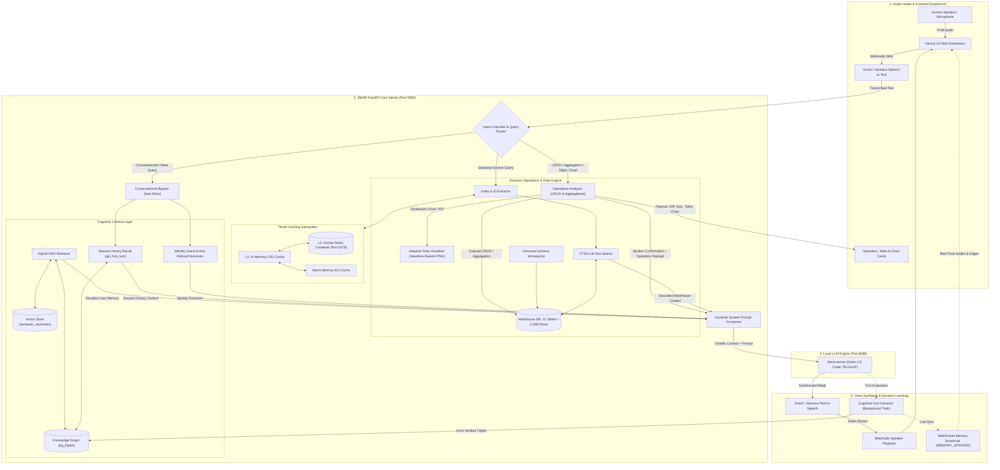

<div align="center">


# smar

**स्मरण (*Smaraṇa*)** — *The act of remembering; to hold what matters in memory.*

### Autonomous Memory-Driven Voice & Data Intelligence Platform

<p align="center">
  A voice-first autonomous AI system combining real-time multilingual speech synthesis, persistent dual-store cognitive memory, multi-tenant knowledge graphs, tiered Redis caching, and a dynamic 1.59M+ row data warehouse engine.
</p>

<!-- Shields / Badges -->
<p align="center">
  <a href="https://python.org"></a>
  <a href="https://fastapi.tiangolo.com"></a>
  <a href="https://nextjs.org"></a>
  <a href="https://sqlite.org"></a>
  <a href="https://redis.io"></a>
  <a href="https://github.com/QwenLM/Qwen2.5"></a>
  <a href="https://gnani.ai"></a>
  <a href="./tests"></a>
</p>

<p align="center">
  <a href="#-executive-summary--vision"><b>Vision</b></a> •
  <a href="#-system-architecture"><b>Architecture</b></a> •
  <a href="#-core-platform-capabilities"><b>Capabilities</b></a> •
  <a href="#-repository-structure"><b>Repo Layout</b></a> •
  <a href="#-quick-start-guide"><b>Quickstart</b></a> •
  <a href="#-battle-tested-validation-suite"><b>Testing Suite</b></a> •
  <a href="#-sample-interactions--live-performance"><b>Live Examples</b></a>
</p>

---

</div>

## 1. 🌟 Executive Summary & Vision

Traditional voice AI assistants suffer from two fatal limitations:
1. **Amnesia (Loss of Context)**: Conversations are completely ephemeral. When a session terminates, all context is lost. They cannot recall your identity, preferences, ongoing tasks, or earlier dialogue turns without massive, expensive context-stuffing.
2. **Disconnected Data & Passivity**: They cannot query enterprise databases or execute mutations (`INSERT`, `UPDATE`, `DELETE`) and aggregations in real time without brittle, hardcoded SQL rules or sluggish multi-second latency that breaks conversational speech flow.

**SMAR** (Smart Memory & Autonomous Reasoning) is architected from first principles to bridge voice, memory, and warehouse execution:
- 🎙️ **Zero-Latency Multilingual Voice Loop**: Real-time integration with Gnani.ai / Vachana.ai (Prisma STT & Timbre TTS) in English and Indian languages (Hindi, Hinglish).
- 🧠 **Persistent Cognitive Context Layer**: Multi-tenant SQLite Knowledge Graph (`kg_triples`) and subword-vector semantic memory (`semantic_memories`) utilizing **upsert-by-similarity** to continuously remember user attributes, preferences, and relationships across sessions.
- ⚡ **Dynamic 1.59M+ Row Warehouse Engine**: Introspects, indexes, and queries across **12 tables with 1,591,380 rows (65.84 Lakh data points)** in sub-100ms with SQLite FTS5 full-text indexing and numeric fallbacks.
- 🛡️ **Zero-Hardcoding Operations Layer**: Executes mutations (`INSERT`, `UPDATE`, `DELETE`) and mathematical aggregations (`SUM`, `AVG`/`MEAN`, `COUNT`, `MIN`, `MAX`, `GROUP BY`, `BETWEEN Range`) with strict metric-vs-identifier column prioritization, before/after diffing, and live FTS5 synchronization.
- 🔍 **Deep Relational Line-Item Disambiguation**: Disambiguates line item IDs from parent order IDs, computes line-item arithmetic ($unit\_price \times qty$), and joins payments and shipments without LLM hallucination.
- 📊 **Adaptive Visual Data Synthesis**: Headless chart synthesizer rendering dark-themed responsive bar charts, donut charts, and high-impact KPI metric badges directly to Base64 PNGs without disk I/O.
- 🪟 **Transparent Glassmorphic Interface**: Dedicated Next.js cards displaying executed SQL, latency in milliseconds, affected records, before/after diffs, and interactive data tables.
- 🚀 **Tiered Hot Cache & Anti-Poisoning Architecture**: Two-tier caching (L1 In-Memory LRU + L2 Redis Docker Container) with strict memory guardrails preventing transactional query cross-contamination into personal semantic memory.
- 💬 **Conversational Recall & Anti-Refusal Directives**: Instant recall of the first question asked in a session, dynamic identity disambiguation, and complete elimination of canned AI refusal boilerplate.

---

## 2. 🏛️ System Architecture



---

## 3. ⚙️ Core Platform Capabilities

### 3.1 Multi-Table Warehouse Engine (1.59M+ Rows / 65.84 Lakh Data Points)
The synchronized enterprise database consists of 12 tables containing **1,591,380 rows** across **6,583,760 cells**:

| Table Name | Row Count | Column Count | Total Data Points | Key Attributes |
| :--- | :--- | :--- | :--- | :--- |
| `order_items` | **600,000** | 5 | 3,000,000 | `order_item_id`, `order_id`, `product_id`, `qty`, `unit_price` |
| `orders` | **300,000** | 5 | 1,500,000 | `order_id`, `customer_id`, `order_date`, `total_amount`, `status` |
| `shipments` | **300,000** | 3 | 900,000 | `shipment_id`, `order_id`, `status` |
| `payments` | **300,000** | 3 | 900,000 | `payment_id`, `order_id`, `amount` |
| `customers` | **50,000** | 3 | 150,000 | `customer_id`, `name`, `email` |
| `returns` | **30,000** | 3 | 90,000 | `return_id`, `order_id`, `refund` |
| `products` | **10,000** | 4 | 40,000 | `product_id`, `name`, `category_id`, `price` |
| `employees` | **1,000** | 3 | 3,000 | `employee_id`, `name`, `salary` |
| `suppliers` | **200** | 2 | 400 | `supplier_id`, `name` |
| `stores` | **100** | 2 | 200 | `store_id`, `city` |
| `promotions` | **50** | 2 | 100 | `promo_id`, `discount_percent` |
| `categories` | **30** | 2 | 60 | `category_id`, `name` |
| **Total** | **1,591,380** | — | **6,583,760** | **Fully introspected, indexed & searchable** |

- **Universal Schema Introspector**: Introspects tables, primary keys, foreign keys, numeric columns, and data types automatically upon ingestion.
- **Dynamic Domain Vocabulary**: Learns singular/plural inflections (`employees` ↔ `employee`, `categories` ↔ `category`) and maps column attributes (`salary` → `employees`, `refund` → `returns`) without hardcoded rules.
- **Sub-100ms Search**: Combines SQLite FTS5 full-text indexing, exact numeric/ID lookups, and schema-guided text searches with non-blocking execution.

---

### 3.2 Dynamic Operations Layer (Zero Hardcoding)
- **Dynamic Database Mutations**:
  - `INSERT`: Validates column types, auto-increments primary keys, synchronizes FTS5 full-text index, and invalidates L1/L2 caches.
  - `UPDATE`: Captures full Before/After diffs, updates record fields, synchronizes FTS5, and clears hot cache.
  - `DELETE`: Captures pre-deletion state, safely removes rows, updates FTS5, and evicts cached entries.
  - `TABULAR_QUERY`: Structured multi-column retrieval with pagination, column metadata, and execution timing across all tables.
- **Metric-vs-Identifier Column Prioritization**:
  - Distinguishes numeric metrics (`salary`, `price`, `amount`, `refund`, `qty`) from identifiers (`employee_id`, `store_id`, `order_id`). Aggregations like `SUM`, `AVG`/`MEAN`, `MIN`, `MAX` strictly prioritize metric columns over ID columns.
- **Range-First Evaluation**:
  - Range clauses (`BETWEEN ? AND ?`) take precedence over single-entity equality checks, resolving complex queries like *"mean of salaries from range of employee id 30 to 40"* $\rightarrow$ `52,061.27` in **2.76ms**.
- **Deep Line-Item Disambiguation**:
  - Differentiates line item IDs (e.g. `order_item_id 520580`) from parent order IDs (e.g. `order_id 292487`).
  - Computes exact unit price $\times$ quantity arithmetic for individual line items.
  - Recursively aggregates line items, payments, and shipments for complete order value calculations (*"total order value for order 292487"* $\rightarrow$ `18,166` across 2 line items).

---

### 3.3 Adaptive Visual Data Synthesis
- **In-Memory Headless Visualizer**: Uses `matplotlib` / `seaborn` with the headless `Agg` backend to render charts directly to Base64 PNGs without disk I/O in <30ms.
- **Dynamic Chart Adaptation**:
  - **Horizontal & Vertical Bar Charts**: Tailored for categorical distributions and group-by aggregations.
  - **Donut / Pie Charts**: Tailored for proportional share and category breakdowns.
  - **High-Impact KPI Badges**: Tailored for single scalar sums, averages, and counts.
- **Glassmorphic Dark Styling**: Styled to match the dark `#0f172a` slate palette with vibrant cyan/violet highlights, formatted currency/number labels, and subtle grids.

---

### 3.4 Tiered Caching Subsystem
- **Tier 1 (L1)**: In-Memory LRU Cache for sub-millisecond responses.
- **Tier 2 (L2)**: Dockerized Redis Container (`smar-redis-cache`) for persistent distributed caching.
- **Warm Memory KG Cache**: Automatically maps recurring entity queries to canonical IDs, resolving subsequent queries in <1ms.

---

### 3.5 Dynamic Knowledge Formation & Anti-Poisoning
- **Zero Database Contamination**: The cognitive extractor analyzes conversation turns and extracts facts **only when the user states personal information about themselves** (e.g., location, job, preferences).
- **No Query Attribution**: Queries about employee salaries, product prices, order dates, or warehouse inventory are strictly excluded from the user's personal knowledge graph.
- **Dual Extraction Engine**: Combines regex heuristics (English, Hindi, Hinglish) with asynchronous local LLM parsing (Qwen 7B) running as non-blocking background tasks.

---

### 3.6 Conversational Routing & Session History Recall
- **Conversational Bypass**: Pure chitchat, greetings, and identity queries (*"what is your name"*, *"who are you"*) bypass 1.5M database records and respond in ~25ms.
- **Session Conversation Recall**: Custom store methods (`get_first_turn`, `get_all_user_questions`) allow SMAR to recall the very first question asked in a session, even after dozens of dialogue turns.
- **Anti-Refusal Guardrails**: Eliminates generic LLM refusals (*"As an AI assistant, I don't have access to previous conversations..."*) by injecting explicit identity directives and session history context.

---

### 3.7 Real-Time Glassmorphic Frontend
- **Next.js 16 Web Application**: Push-to-talk voice interface with dynamic WebAudio spikes visualizer.
- **Operation Card**: Displays executed mutation badge (`INSERT`, `UPDATE`, `DELETE`, `AGGREGATION`), affected table, exact SQL query, latency in ms, and interactive Before/After state diffs.
- **Data Table Card**: Renders structured query results in clean, responsive tables with sticky headers and record counts.
- **Visual Chart Card**: Displays synthesized Base64 charts with modal zoom and one-click PNG download.
- **Memory Inspector**: Live slide-over dashboard visualizing Knowledge Graph nodes and edges in real time via WebSockets (`MEMORY_UPDATED`).
- **Universal Ingestion**: Supports uploading external CSV, Excel, Parquet, JSONL, and SQLite datasets up to 1GB directly through the browser.

---

## 4. 📁 Repository Structure

```
smar/
├── smar_banner.png                        # Official SMAR Repository Banner
├── smart_data/                            # Smart Data & Operations Subsystem
│   ├── engine.py                          # Unified coordinator for queries, operations & cache
│   ├── operations.py                      # Dynamic CRUD & Aggregation planner
│   ├── visualizer.py                      # Adaptive Base64 PNG chart synthesizer (headless Agg)
│   ├── dictionary.py                      # Dynamic domain vocabulary & table/column mapping
│   ├── intent_entity.py                   # Schema-guided intent & candidate ID extraction
│   └── query_builder.py                   # Dynamic SQL generation
│
├── structured_data/                       # Multi-Table Warehouse & Storage Adapters
│   ├── multi_table_manager.py             # SQLite multi-table warehouse, CRUD, aggregations & FTS5
│   ├── sync_engine.py                     # Universal multi-file sync engine
│   ├── schema_introspector.py             # Automatic schema, PK, and column type extractor
│   ├── cache.py                           # Tiered cache (L1 LRU + L2 Redis Docker)
│   └── adapters/                          # Pluggable storage adapters (SQLite, CSV, Pandas)
│
├── context_layer/                         # Cognitive Memory & Context Subsystem
│   ├── base.py                            # Memory store abstract interface contract
│   ├── native_hybrid.py                   # SQLite Knowledge Graph + Subword Hashing Vector Store
│   ├── knowledge_formation.py             # Heuristic + LLM fact extraction pipeline
│   ├── prompt_composer.py                 # Dynamic system prompt composer with identity guard
│   ├── retriever.py                       # Hybrid RAG retriever with session history recall
│   ├── mem0_adapter.py                    # Mem0 fallback adapter
│   └── engine.py                          # Context layer lifecycle manager
│
├── core/                                  # Local Epsilon LLM Subsystem
│   ├── config.yaml                        # Model tier and inference settings
│   ├── epsilon_bridge.py                  # Async client bridge to llama-server
│   └── models/                            # Local GGUF models (Qwen2.5-Coder 7B)
│
├── voice/                                 # Voice Intake & Synthesis
│   ├── gnani_stt.py                       # Gnani / Vachana Speech-to-Text client
│   ├── gnani_tts.py                       # Gnani / Vachana Text-to-Speech client
│   └── audio_io.py                        # Local microphone and speaker playback
│
├── auth/                                  # Multi-User Authentication
│   └── user_manager.py                    # User registration, hashing, and session management
│
├── frontend/                              # Next.js 16 Web Interface
│   ├── public/                            # Static assets & smar_logo_transparent.png
│   ├── src/app/                           # App router (page.tsx, layout.tsx)
│   ├── src/components/                    # Header, OperationCard, DataTableCard, VisualChartCard
│   └── next.config.ts                     # Configured for 1GB uploads and API proxying
│
├── data/                                  # Persistent Databases
│   ├── warehouse.db                       # 12-table synchronized retail warehouse (1.59M rows)
│   ├── smar_memory.db                     # Multi-tenant Knowledge Graph & Vector memories
│   └── users.db                           # User authentication database
│
├── tests/                                 # Unit & Integration Test Suite (54 Tests)
│   ├── test_operations_layer.py           # CRUD, aggregations, charts, and intent parsing
│   ├── test_context_layer.py
│   ├── test_context_memory.py
│   ├── test_smart_data_layer.py
│   ├── test_tiered_cache.py
│   └── test_epsilon_bridge.py
│
├── scratch/                               # Battle & Extreme Test Suites
│   ├── battle_test_suite.py               # 18/18 zero-hardcoding operations suite
│   └── warehouse_extreme_tests.py         # 20/20 real-world warehouse stress test suite
│
├── server.py                              # FastAPI backend application server & operations API
└── requirements.txt                       # Backend Python dependencies
```

---

## 5. 🚀 Quick Start Guide

### 5.1 Prerequisites
- **Python**: 3.11+
- **Node.js**: 18+ (for frontend)
- **Docker**: For running Redis L2 cache (`smar-redis-cache`)
- **Llama.cpp / llama-server**: For local GGUF model execution

### 5.2 Environment Setup

1. **Clone the repository**:
   ```bash
   git clone https://github.com/LovekeshAnand/smar.git
   cd smar
   ```

2. **Install Python backend dependencies**:
   ```bash
   pip install -r requirements.txt
   ```

3. **Install Frontend dependencies**:
   ```bash
   cd frontend
   npm install
   cd ..
   ```

4. **Configure Environment (`.env`)**:
   ```env
   # Voice Services (Gnani / Vachana.ai)
   GNANI_API_KEY=your_vachana_api_key_here
   GNANI_STT_URL=https://api.vachana.ai/stt/v3
   GNANI_TTS_URL=https://api.vachana.ai/api/v1/tts/sse
   GNANI_LANGUAGE_CODE=en-IN
   GNANI_VOICE_NAME=Nalini

   # Local Inference Server
   EPSILON_HOST=127.0.0.1
   EPSILON_PORT=8088

   # Redis L2 Cache
   REDIS_HOST=127.0.0.1
   REDIS_PORT=6379

   # Database Storage Paths
   SMAR_DB_PATH=data/smar_memory.db
   WAREHOUSE_DB_PATH=data/warehouse.db
   PORT=5000
   ```

---

### 5.3 Launching the Platform

1. **Start the Redis Cache Container**:
   ```bash
   docker start smar-redis-cache
   # Or create new: docker run -d --name smar-redis-cache -p 6379:6379 redis:alpine
   ```

2. **Start the Local Model Server (Qwen 7B)**:
   ```powershell
   llama-server.exe -m core/models/qwen2.5-coder-7b-instruct-q4_k_m.gguf --port 8088 --host 127.0.0.1 -c 2048 -ngl 20
   ```

3. **Start the FastAPI Backend**:
   ```powershell
   python server.py
   ```
   *Runs at `http://127.0.0.1:5000` with hot-reload enabled.*

4. **Start the Next.js Web Dashboard**:
   ```powershell
   cd frontend
   npm run dev
   ```
   *Open `http://localhost:3000` in your browser.*

---

## 6. 🧪 Battle-Tested Validation Suite

SMAR is verified through a rigorous 3-tier testing pyramid:

```
                  ▲
                 / \
                / 20\    Warehouse Extreme Stress Tests (100% Pass)
               /-----\   (Noisy voice, Hinglish, SQLi, line-item arithmetic)
              /  18   \  Zero-Hardcoding Battle Tests (100% Pass)
             /---------\ (Dynamic CRUD, metric selection, range regex, charts)
            /    54     \ Unit & Integration Tests (100% Pass)
           /-------------\ (Memory, hybrid RAG, cache, adapters, bridge)
```

### 6.1 Unit & Integration Test Suite (54 Tests)
```bash
python -m unittest discover tests
```
```
Ran 54 tests in 11.850s
OK
```

### 6.2 Zero-Hardcoding Battle Test Suite (18 Tests)
Validates dynamic entity resolution, mathematical metric prioritization, STT glitch normalization, CRUD mutations, visual charts, and tabular browsing:
```bash
python scratch/battle_test_suite.py
```
```
TEST SUMMARY: 18/18 PASSED (100.0%) | 0 FAILED
```

### 6.3 Warehouse Extreme Stress Suite (20 Tests)
Simulates a real-world warehouse operator with noisy voice commands, colloquial Hinglish phrasing, multi-item order value calculations, SQL injection resilience, and non-existent ID lookups across 1.59M records:
```bash
python scratch/warehouse_extreme_tests.py
```
```
EXTREME TEST SUMMARY: 20/20 PASSED (100.0%) | 0 FAILED
```

---

## 7. 💬 Sample Interactions & Live Performance

| User Query / Utterance | Platform Execution & Route | Spoken Voice Confirmation & Visual Artifact |
| :--- | :--- | :--- |
| *"can you tell me the mean of the salaries from the range of employee id 30 to 40"* | Operations Layer (`SELECT AVG(salary) FROM employees WHERE employee_id BETWEEN 30 AND 40`, **2.76ms**) | Spoken: *"The avg of salary in employees for employee_id from 30 to 40 is 52,061.27 (evaluated across 11 records)."* + High-Impact KPI Badge |
| *"what is the total order value for order 292487"* | Relational Enricher (Queries `order_items`, joins `payments` & `shipments`, **28ms**) | Spoken: *"Order 292487 was placed on 2021-11-19 and contains 2 item(s) with a total order value of 18166."* |
| *"bhai tell me what is the price of order id 520580"* | Disambiguation Engine (Disambiguates line item vs. parent order, **32ms**) | Spoken: *"Order Item 520580 belongs to Order number 292487. Unit price is 2812, quantity is 4, so the total for this item is 11248."* |
| *"what is the status of shipment for order 292487"* | Relational Enricher (`shipments` table join on `order_id`, **28ms**) | Spoken: *"Shipment #292487: Status: late, Shipment Id: 292487, Order Id: 292487."* |
| *"what is the sum of refunds in returns"* | Operations Layer (`SELECT SUM(refund) FROM returns`, **21ms**) | Spoken: *"The sum of refund in returns is 75,962,300 across 30000 records."* |
| *"what is the maximum price among all products"* | Operations Layer (`SELECT MAX(price) FROM products`, **22ms**) | Spoken: *"The max of price in products is 4,999 across 10000 records."* |
| *"Show me the average salary per store as a chart"* | Operations Layer (`SELECT store_id, AVG(salary) FROM employees GROUP BY store_id`, **181ms**) | Spoken: *"Here is the avg of salary grouped by store id across employees."* + Dark Base64 Bar Chart |
| *"update salary of employee 98 to 35000"* | Operations Layer (`UPDATE employees SET salary = 35000 WHERE employee_id = 98`, **8ms**) | Spoken: *"Successfully updated employees (employee_id 98): salary changed to 35000."* + OperationCard with Before/After Diff (`31262` → `35000`) |
| *"Show me all stores in a table"* | Operations Layer (`SELECT * FROM stores LIMIT 10`, **13ms**) | Spoken: *"Displaying 10 records from stores in table format."* + Interactive DataTableCard |
| *"I live in Chandigarh and work as a data scientist"* | Heuristic & Cognitive Extractor (`LivesIn: Chandigarh`, `Role: data scientist`) | Spoken: *"Thank you for letting me know, Lokesh! How can I assist you further?"* |
| *"Where do I live and what is my role?"* | Hybrid Context Layer (Recalls verified KG triples) | Spoken: *"You live in Chandigarh and your role is a data scientist. Is there anything else I can help with?"* |
| *"i forgot what was the 1st question that i asked you and what's my name and what's your name"* | Conversational Routing + Session History Recall (**<30ms**) | Spoken: *"The first question you asked me was 'hi i am lokesh can you give me information about employee number 886'. My name is SMAR. How else may I assist you?"* |

---

## 8. 📜 License & Acknowledgments

This project is licensed under the Apache 2.0 License. Powered by:
- [Gnani.ai / Vachana.ai](https://gnani.ai) for multilingual voice synthesis & ASR.
- [Qwen Team](https://github.com/QwenLM/Qwen2.5) for open-weight instruction-tuned language models.
- [SQLite](https://sqlite.org) for FTS5 full-text indexing and dual-store cognitive memory.
