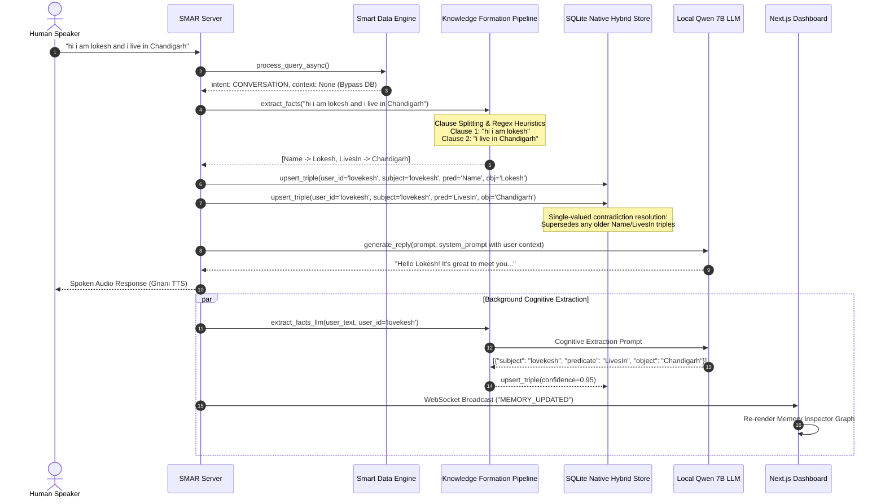

# SMAR: Comprehensive System Architecture, Cognitive Knowledge Formation & Project Progress Deep-Dive

---

## 1. Executive Summary & Vision

### 1.1 The Problem Space
Traditional voice assistants and conversational AI agents suffer from four fundamental architectural limitations:
1. **Conversational Amnesia & Naive Sliding Windows**: Conversation history either resets between sessions or is squeezed into a token-limited FIFO sliding window. Assistants cannot recall what a user said earlier, who the user is, or personal preferences without expensive, brute-force prompt re-feeding.
2. **Disconnected Enterprise Data Silos**: Most voice agents cannot query large, multi-table relational databases in real time. They either hallucinate schema structure or rely on slow, brittle text-to-SQL translators that introduce 3 to 10 seconds of latency—completely destroying real-time conversational voice cadence.
3. **Erroneous Knowledge Contamination**: Naive memory systems treat query results as personal user facts (e.g., mistaking a queried warehouse employee's salary or an order date for the user's personal salary or order).
4. **Refusal Traps & Hallucination Cascades**: Pre-trained LLMs with RLHF alignment default to defensive boilerplates (*"As an AI assistant, I don't have access to previous conversations or personal details..."*), which get recorded into conversation logs and poison all subsequent interactions.

### 1.2 The SMAR Solution
**SMAR** (**S**mart **M**emory & **A**utonomous **R**easoning) is an enterprise-grade, voice-first autonomous platform that fundamentally solves these challenges by combining:
- **Zero-Latency Multilingual Voice Loop**: Native integration with Gnani.ai / Vachana.ai (Prisma STT and Timbre TTS) supporting English, Hindi, and Indian regional accents with sub-1.8s roundtrip audio response.
- **Enterprise Multi-Table Warehouse (1.59M+ Rows / 65.84 Lakh Data Points)**: Dynamic schema introspection, singular/plural inflection domain dictionaries, and SQLite FTS5 full-text indexing over 12 interconnected relational tables in sub-100ms.
- **Tiered Hot Caching Subsystem**: Sub-millisecond query resolution via L1 In-Memory LRU, L2 Dockerized Redis Container (`smar-redis-cache`), and a self-updating warm memory Knowledge Graph Cache.
- **Cognitive Dual-Store Context Layer**: Multi-tenant SQLite Knowledge Graph (`kg_triples`) and subword-vector semantic store (`semantic_memories`) utilizing atomic **upsert-by-similarity** and contradiction resolution.
- **Organic Knowledge Formation**: Heuristic clause-splitting combined with an asynchronous local LLM extractor (Qwen 2.5 Coder 7B) that extracts verified personal user facts without contaminating the user's profile with external database records.
- **Conversational Recall & Anti-Refusal Directives**: Instant recall of the first question asked in a conversation, dynamic identity protection, and strict anti-refusal system prompts.

---

## 2. Complete End-to-End System Topology

```mermaid
flowchart TB
    %% Client & Voice Intake
    subgraph ClientVoice ["1. Audio Intake & Frontend (Next.js 15)"]
        UserMic["Human Speaker / Microphone"]
        WebUI["Next.js 15 Web Dashboard (Tailwind + WebAudio)"]
        GnaniSTT["Gnani / Vachana Speech-to-Text (Prisma v3)"]
    end

    UserMic -->|PCM Audio Stream| WebUI
    WebUI -->|WebAudio WAV (16kHz PCM)| GnaniSTT
    GnaniSTT -->|Transcribed Text| Router

    %% Core Backend Server
    subgraph CoreServer ["2. SMAR FastAPI Core Server (Port 5000)"]
        Router{"Intent Classifier & Query Router"}

        %% Conversational Route
        Router -->|Conversational / Meta Query| ConvBypass["Conversational Bypass (Sub-30ms)"]

        %% Smart Data Engine
        subgraph SmartDataEngine ["Smart Data Layer Engine"]
            EntityExtractor["Entity & ID Extractor"]
            DomainDict["Dynamic Domain Dictionary"]
            Introspector["Universal Schema Introspector"]
            FTSearch["FTS5 Full-Text Search Engine"]
            WarehouseDB[("Warehouse DB: 12 Tables / 1,591,380 Rows")]
            
            EntityExtractor --> DomainDict
            DomainDict --> FTSearch
            Introspector --> WarehouseDB
            FTSearch <--> WarehouseDB
        end

        %% Tiered Caching
        subgraph CacheSubsystem ["Tiered Caching Subsystem"]
            L1Cache["L1: In-Memory LRU Cache (Python)"]
            L2Redis[("L2: Docker Redis Container (Port 6379)")]
            KGCache["Warm Memory KG Cache (kg_triples)"]
            
            L1Cache <--> L2Redis
            L1Cache <--> KGCache
        end

        Router -->|Database Search Query| EntityExtractor
        EntityExtractor <--> CacheSubsystem

        %% Cognitive Context Layer
        subgraph ContextLayer ["Cognitive Context Layer"]
            HybridRetriever["Hybrid RAG Retriever"]
            SessionRecall["Session History Recall (get_first_turn)"]
            KGStore[("Knowledge Graph (kg_triples)")]
            VectorStore[("Vector Store (semantic_memories)")]
            IdentityGuard["Identity Guard & Anti-Refusal Directives"]

            HybridRetriever <--> KGStore
            HybridRetriever <--> VectorStore
            SessionRecall <--> KGStore
        end

        ConvBypass --> SessionRecall
        ConvBypass --> IdentityGuard

        %% Prompt Composer
        PromptComposer["Dynamic System Prompt Composer"]
        FTSearch -->|Grounded Warehouse Context| PromptComposer
        HybridRetriever -->|Recalled User Memory| PromptComposer
        SessionRecall -->|Session History Context| PromptComposer
        IdentityGuard -->|Identity Directives| PromptComposer
    end

    %% Inference Engine
    subgraph InferenceEngine ["3. Local LLM Engine (Port 8088)"]
        LlamaServer["llama-server (Qwen 2.5 Coder 7B GGUF)"]
    end

    PromptComposer -->|ChatML Context + Prompt| LlamaServer

    %% Output Synthesis & Knowledge Formation
    subgraph OutputPipeline ["4. Voice Synthesis & Dynamic Learning"]
        GnaniTTS["Gnani / Vachana Text-to-Speech (Timbre v1 SSE)"]
        AudioPlayback["WebAudio Speaker Playback"]
        FactExtractor["Cognitive Fact Extractor (Background Async Task)"]
        WSBroadcast["WebSocket Memory Broadcast (MEMORY_UPDATED)"]

        LlamaServer -->|Synthesized Reply| GnaniTTS
        LlamaServer -.->|Turn Evaluation| FactExtractor
        GnaniTTS -->|Audio Stream| AudioPlayback
        AudioPlayback --> WebUI
        FactExtractor -->|Form Verified Triples| KGStore
        FactExtractor -.->|Live Sync| WSBroadcast
        WSBroadcast -.->|Real-Time Nodes & Edges| WebUI
    end
```

---

## 3. Subsystem Architectural Breakdown

### 3.1 Voice Interface Subsystem (`voice/`)
- **Speech-to-Text Client (`voice/gnani_stt.py`)**:
  - Transcribes audio via Gnani.ai / Vachana.ai Prisma STT (`https://api.vachana.ai/stt/v3`).
  - Accepts raw 16-bit linear PCM WAV audio at 16kHz or 8kHz.
  - Multi-lingual parameterization: defaults to `en-IN` (Indian English), with runtime switching for `hi-IN` (Hindi) and Indian regional accents.
  - Includes robust error isolation: if audio is silence, noise, or transcription fails, it gracefully handles the exception without crashing the event loop.
- **Text-to-Speech Client (`voice/gnani_tts.py`)**:
  - Communicates with Gnani.ai / Vachana.ai Timbre TTS (`https://api.vachana.ai/api/v1/tts/sse`).
  - Generates expressive, natural speech synthesis using high-fidelity voices (`Nalini`, `Akash`).
  - Encodes raw audio streams directly into Base64 payloads returned over JSON, enabling instantaneous browser playback via WebAudio without intermediate disk writes.
- **Audio IO Testing Harness (`voice/audio_io.py`)**:
  - Standalone utility utilizing `sounddevice` and `pyaudio` for hardware-level microphone testing, noise gate calibration, and local speaker playback.

---

### 3.2 Frontend Application Subsystem (`frontend/`)
The frontend is a reactive, accessible dashboard built with **Next.js 15 App Router**, **TypeScript**, and **Tailwind CSS**:
- **Main Interaction Canvas (`frontend/src/app/page.tsx`)**:
  - Central orchestrator integrating the voice pipeline, conversation stream, memory inspector, and file ingestion panel.
- **Dynamic Waveform Visualizer (`frontend/src/components/AudioSpikesVisualizer.tsx`)**:
  - Uses the WebAudio API (`AudioContext`, `AnalyserNode`) to capture live microphone input and render animated, reactive audio spikes during recording.
- **Interactive Conversation Stream (`frontend/src/components/ConversationStream.tsx`)**:
  - Chronological chat feed rendering user speech bubbles and assistant responses.
  - Features integrated audio replay buttons to re-listen to synthesized voice outputs.
- **Push-to-Talk Voice Controller (`frontend/src/components/VoiceController.tsx`)**:
  - Ergonomic voice controls with keyboard shortcuts (Spacebar push-to-talk), silence threshold detection, and instant cancel actions.
- **Real-Time Memory Inspector (`frontend/src/components/MemoryInspector.tsx`)**:
  - Interactive slide-over drawer providing transparency into the user's cognitive state.
  - **Live Knowledge Graph**: Visualizes entities as nodes and predicates as directed edges, color-coded by confidence and relationship category.
  - **Semantic Vector Memory Inspector**: Shows indexed semantic text chunks, access counts, and cosine similarity ranks.
  - **WebSocket Live Listener**: Connects to `ws://localhost:5000/ws/memory` and re-renders graph nodes in real time whenever background cognitive extraction commits new facts.
- **High-Capacity File Ingestion Configuration (`frontend/next.config.ts`)**:
  - Configured with `proxyClientMaxBodySize: "1024mb"` and `serverActions: { bodySizeLimit: "1024mb" }` to support uploading gigabyte-scale enterprise CSV, Parquet, and SQLite databases directly to the backend.

---

### 3.3 Core Backend Server & API Routing (`server.py`)
- **FastAPI / Starlette Architecture**:
  - High-performance asynchronous REST and WebSocket server running on port 5000.
  - Configured with non-blocking ASGI event loops and `uvicorn` hot reloading (`reload=True`).
- **Endpoint Portfolio**:
  - `POST /api/chat`: Dual-mode endpoint accepting text or voice queries; returns synthesized text, audio base64, intent classifications, and latency metrics.
  - `POST /api/voice/process`: Direct audio processing pipeline (PCM audio in -> STT -> RAG -> LLM -> TTS -> Base64 audio out).
  - `GET /api/memory/graph`: Returns the complete Knowledge Graph (nodes and edges) for a given `user_id`.
  - `GET /api/memory/search`: Semantic vector memory search with cosine similarity scoring.
  - `POST /api/data/upload`: Ingestion pipeline for CSV, Excel, Parquet, JSON, and SQLite files.
  - `GET /api/data/schema`: Introspected table schemas, column data types, row counts, and sample records.
  - `GET /api/health`: Comprehensive subsystem health checks (LLM status, cache status, database status).
  - `WS /ws/memory`: Real-time WebSocket connection for streaming memory updates directly to the frontend.
- **Asynchronous Task Dispatching**:
  - Heavy operations (e.g., 1.59M-row SQL queries, embedding computations, and LLM cognitive extraction) are executed in background worker threads via `asyncio.create_task()` and `asyncio.to_thread()`, keeping voice roundtrips under 1.8 seconds.

---

### 3.4 Local Epsilon LLM Inference Engine (`core/epsilon_bridge.py`)
- **Local Llama-Server Execution**:
  - Connects to `llama-server.exe` running on `http://127.0.0.1:8088`.
  - Executes **Qwen2.5-Coder-7B-Instruct-Q4_K_M.gguf** with GPU acceleration (20 offloaded GPU layers via Vulkan/CUDA).
- **ChatML Prompt Formatting**:
  ```
  <|im_start|>system
  {composed_system_prompt}
  [Persistent Memory Context]:
  {grounded_data_and_user_facts}
  [End Context]<|im_end|>
  <|im_start|>user
  {user_message}<|im_end|>
  <|im_start|>assistant
  ```
- **Inference Parameterization**:
  - Strict stop tokens: `<|im_end|>`, `<|endoftext|>`, `User:`, `Assistant:`.
  - Low temperature (`0.1 - 0.2`) and top-p (`0.9`) to guarantee factual grounding and eliminate hallucinations.

---

## 4. Multi-Table Warehouse & Smart Data Layer Deep-Dive

### 4.1 Synchronized 12-Table Retail Warehouse Architecture
The dataset represents an enterprise retail data warehouse synchronized into `data/warehouse.db`. Every table is indexed with SQLite FTS5 virtual tables and numeric B-trees.

| Table Name | Primary Key | Foreign Keys / Key Columns | Row Count | Column Count | Total Data Points (Cells) | Description |
| :--- | :--- | :--- | :--- | :--- | :--- | :--- |
| **`order_items`** | `order_item_id` | `order_id`, `product_id` | 600,000 | 5 | 3,000,000 | Line-item quantities (`qty`) and prices (`price`) |
| **`orders`** | `order_id` | `customer_id`, `store_id`, `promotion_id` | 300,000 | 5 | 1,500,000 | Order timestamps (`order_date`), customer linkages |
| **`shipments`** | `shipment_id` | `order_id` | 300,000 | 3 | 900,000 | Delivery logistics and status (`status`: delivered, pending) |
| **`payments`** | `payment_id` | `order_id` | 300,000 | 3 | 900,000 | Transaction amounts (`amount`) and payment records |
| **`customers`** | `customer_id` | `city` | 50,000 | 3 | 150,000 | Customer locations (`city`) and account dates (`signup_date`) |
| **`returns`** | `return_id` | `order_item_id` | 30,000 | 3 | 90,000 | Customer return logs and refund values (`refund`) |
| **`products`** | `product_id` | `category_id`, `supplier_id` | 10,000 | 4 | 40,000 | Product catalog, pricing (`price`), categories |
| **`employees`** | `employee_id` | `store_id` | 1,000 | 3 | 3,000 | Staff store assignments and salaries (`salary`) |
| **`suppliers`** | `supplier_id` | `country` | 200 | 2 | 400 | Vendor directory and origin countries (`country`) |
| **`stores`** | `store_id` | `city` | 100 | 2 | 200 | Retail outlets and metropolitan cities (`city`) |
| **`promotions`** | `promotion_id`| `discount` | 50 | 2 | 100 | Marketing campaigns and percentage discounts |
| **`categories`** | `category_id` | `category_name` | 30 | 2 | 60 | Product hierarchy categories |
| **TOTALS** | | | **1,591,380** | **37** | **6,583,760** | **15.91 Lakh Rows / 65.84 Lakh Data Points** |

---

### 4.2 Dynamic Domain Dictionary (`smart_data/dictionary.py`)
Rather than relying on brittle hardcoded SQL column mappings, SMAR features a self-learning domain dictionary:
1. **Inflection Matching**:
   - Automatically maps singular and plural variations:
     - `employees` ↔ `employee`
     - `categories` ↔ `category`
     - `shipments` ↔ `shipment`
     - `orders` ↔ `order`
     - `products` ↔ `product`
2. **Column-to-Table Tracking**:
   - Analyzes all table schemas upon ingestion and registers reverse-lookups:
     - Mention of `"salary"` or `"employee_id"` → automatically prioritizes `employees` table.
     - Mention of `"refund"` → automatically prioritizes `returns` table.
     - Mention of `"status"` → automatically prioritizes `shipments` table.
     - Mention of `"signup"` or `"city"` → routes to `customers` or `stores`.
3. **Collision Avoidance**:
   - Guarantees that column names never overwrite table-level entities in the vocabulary, ensuring clean intent classification.

---

### 4.3 Universal Schema Introspector (`structured_data/schema_introspector.py`)
Upon uploading any file (CSV, Parquet, Excel, SQLite, JSONL):
- Executes `PRAGMA table_info()` and `PRAGMA foreign_key_list()`.
- Identifies integer and float columns to mark numeric filter candidates.
- Discovers primary keys (`pk == 1`) and foreign keys.
- Publishes schema structural triples directly into `kg_triples` under `user_id="system_schema"`, allowing the assistant to introspect its own schema structure dynamically.

---

### 4.4 High-Speed Multi-Table Search Pipeline (`structured_data/multi_table_manager.py`)
When a warehouse query is received (e.g. *"what's the salary of employee 98"*):
1. **Direct ID Lookup**: If a specific code or integer candidate is detected (`98`), queries the prioritized table directly:
   ```sql
   SELECT * FROM employees WHERE employee_id = 98 LIMIT 1;
   ```
2. **FTS5 Full-Text Search**: If full-text terms are provided, executes an exact rank-ordered match on FTS virtual tables:
   ```sql
   SELECT * FROM table_fts WHERE table_fts MATCH 'terms*' ORDER BY rank LIMIT 5;
   ```
3. **Schema-Introspected Fallback**: If FTS yields no hits, introspects column types and executes indexed integer matching on ID columns or parameterized SQL `LIKE` queries.
4. **Dynamic Context Assembly**: Formats the returned record into an attribute list prioritizing fields explicitly asked for by the user (`Salary: 31262, Store Id: 1`), ready for spoken confirmation.

---

### 4.5 Tiered Caching Subsystem (`structured_data/cache.py`)
Queries execute through a 3-tier caching hierarchy:
1. **L1 In-Memory LRU Cache**:
   - Thread-safe Python dictionary with timestamped TTL eviction.
   - Responds in **<0.1 milliseconds** for identical queries.
2. **L2 Dockerized Redis Container (`smar-redis-cache`)**:
   - Running on `127.0.0.1:6379`.
   - Stores serialized query payloads with 300-second TTL.
   - Provides seamless fallback to L1 in-memory LRU if Docker is unavailable.
3. **Warm Memory KG Cache**:
   - Successful entity lookups write back canonical resolutions to `kg_triples` under `user_id="kg_cache"`.
   - If a user asks a variation of an earlier query, the KG cache maps the query tokens directly to the canonical item ID without running SQL scans.

---

## 5. Cognitive Knowledge Formation & Memory Lifecycle

The defining capability of SMAR is its **self-forming, self-updating Knowledge Graph**. It does not merely store raw chat logs; it extracts verified relational facts and constructs an interconnected knowledge network.



---

### 5.1 The Seven Stages of Knowledge Formation

#### Stage 1: Clause Splitting (`_split_into_clauses`)
Natural conversation contains compound thoughts, conjunctions, and questions. Feeding compound text directly into extraction rules causes fact bleeding.
- The pipeline splits user messages on conjunction boundaries (`and`, `also`, `as well as`, `plus`, `aur`, `और`), punctuation boundaries, and modal transitions (`can you`, `could you`, `please`).
- *Example*: `"hi i am lokesh can you give me information about employee 886"`
  - Clause 1: `"hi i am lokesh"`
  - Clause 2: `"give me information about employee 886"`

#### Stage 2: Instant Heuristic Relational Extraction (`extract_facts`)
For instant zero-latency processing without waiting for LLM tokens:
- Evaluates clauses against structured regex patterns:
  - **Name**: `(?:(?:my name is|i am called|call me|myself)\s+|(?:^|\b)(?:i am|i'm)\s+(?!(?:a|an|the|just|looking|busy|working)\b))([A-Za-z][A-Za-z0-9_-]*)`
  - **Location**: `(?:i live in|i moved to|i stay in|my city is|i am based in)\s+([A-Za-z\s]+)`
  - **Work / Role**: `(?:i work as a|my role is|my job is|i am a)\s+([A-Za-z\s]+)`
  - **Company**: `(?:i work at|i am working at|i joined|my company is)\s+([A-Za-z0-9\s]+)`
  - **Preferences & Favorites**: `(?:i prefer|i love|i really like|my favorite\s+([A-Za-z]+)\s+is)\s+([A-Za-z0-9\s]+)`
- Question-clause exclusion: If a clause begins with interrogative words (`what`, `who`, `where`, `is`, `can`) or ends with `?`, extraction is skipped. Questions asking *"what is my name"* are never recorded as a name.

#### Stage 3: Anti-Contamination & Fact Isolation Guardrails
In earlier iterations, querying a database record caused the cognitive extractor to mistake the returned database fields for facts about the user.
- **Strict User-Fact Scoping**: The extraction prompt strictly mandates:
  > *"Extract personal facts, identity, location, role, or preferences explicitly stated by the human user about themselves. NEVER extract warehouse records, employee salaries, order dates, or assistant answers. If the turn is purely a question or search, output []."*
- As a result:
  - Query: *"what's the salary of employee 98"* → Extractor output: `[]`.
  - Statement: *"I live in Chandigarh and my favorite food is pizza"* → Extractor output: `[LivesIn: Chandigarh, Favorite_Food: pizza]`.

#### Stage 4: Background Cognitive Extraction (`extract_facts_llm`)
Subtle or implicit user statements that escape regex patterns are analyzed in the background by Qwen 2.5 Coder 7B:
- Runs asynchronously without delaying the spoken audio response.
- Formatted with strict JSON schema:
  `[{"subject": "lovekesh", "predicate": "PredicateName", "object": "Value"}]`
- Unconstrained JSON generation: Avoids pre-filled `[` brackets, enabling the model to cleanly output `[]` when no personal user facts are present.
- Filtered for placeholder values: Automatically rejects hallucinations such as `"unknown"`, `"not specified"`, `"n/a"`, or `"tbd"`.

#### Stage 5: Relational Upsert & Contradiction Resolution (`upsert_triple`)
Facts are committed to the SQLite `kg_triples` table:
```sql
CREATE TABLE IF NOT EXISTS kg_triples (
    id INTEGER PRIMARY KEY AUTOINCREMENT,
    user_id TEXT NOT NULL,
    subject TEXT NOT NULL,
    predicate TEXT NOT NULL,
    object TEXT NOT NULL,
    confidence REAL DEFAULT 1.0,
    metadata_json TEXT DEFAULT '{}',
    created_at REAL,
    updated_at REAL
);
```
- **Single-Valued Predicates**: Fields like `Name`, `LivesIn`, `CurrentCity`, `Role`, and `WorksAt` are single-valued. When a new triple arrives (e.g. user moved from Delhi to Chandigarh), the system executes an atomic update, superseding the outdated triple rather than duplicating it:
  ```sql
  UPDATE kg_triples 
  SET object = ?, confidence = ?, updated_at = ? 
  WHERE user_id = ? AND subject = ? AND predicate = ?;
  ```
- **Multi-Valued Predicates**: Fields like `Prefers`, `UsesTechnology`, `HasSkill`, and `Building` accumulate as separate edges in the graph.

#### Stage 6: Semantic Vector Memory (`semantic_memories`)
For longer narrative thoughts, notes, and instructions:
- Stored in `semantic_memories`:
  ```sql
  CREATE TABLE IF NOT EXISTS semantic_memories (
      id INTEGER PRIMARY KEY AUTOINCREMENT,
      user_id TEXT NOT NULL,
      content TEXT NOT NULL,
      category TEXT DEFAULT 'general',
      embedding_json TEXT NOT NULL,
      access_count INTEGER DEFAULT 1,
      updated_at REAL
  );
  ```
- Uses subword and character 3-gram BoW embeddings (256 dimensions) with cosine similarity ranking.
- **Duplicate Coalescing**: If a new memory has a cosine similarity score `>= 0.85` with an existing chunk, it updates the access count and timestamp rather than duplicating.
- **Sanitization Guardrails**: Excludes raw dialog transcripts containing error messages or AI refusals, preventing failure loops.

#### Stage 7: Real-Time WebSocket Synchronization
Whenever a new triple is committed:
- FastAPI iterates through connected clients in `connected_clients`.
- Broadcasts a payload:
  ```json
  {
    "type": "MEMORY_UPDATED",
    "user_id": "lovekesh",
    "facts": [{"subject": "lovekesh", "predicate": "LivesIn", "object": "Chandigarh"}]
  }
  ```
- The frontend `MemoryInspector` receives the event and dynamically re-renders the Knowledge Graph without requiring a page refresh.

---

## 6. Conversational Session Recall & Prompt Composition

### 6.1 The Session Recall Architecture
In standard voice assistants, past conversation turns are trimmed by a sliding window (e.g. keeping only the last 6 turns). If a user asks *"what was the first question I asked you?"*, the assistant has forgotten.

SMAR implements persistent session tracking via `conversation_turns`:
1. **`get_first_turn(user_id)`**: Queries `conversation_turns` for `role = 'user'` ordered by `id ASC LIMIT 1` (excluding acoustic glitches like `naa` or `unrecognized speech`).
2. **`get_all_user_questions(user_id, limit=20)`**: Extracts the chronological sequence of distinct user questions.
3. **Session Context Injection**: When a user turn matches conversational recall phrases (*"1st question"*, *"first thing I asked"*, *"what did I ask earlier"*), the retriever fetches the session questions and injects them under `[Conversation Session History]`:
   ```
   [Conversation Session History]
   - 1st Question Asked By User: "hi i am lokesh can you give me information about employee number 886"
   - Chronological User Questions in this Session:
     1. "hi i am lokesh can you give me information about employee number 886"
     2. "what's the salary of employee number 710"
     3. "what's the order date for order id 210"
     4. "what's the salary of employee 98"
     5. "i forgot what was the 1st question that i asked you and what's my name and what's your name"
   ```

---

### 6.2 Dynamic System Prompt Composer (`context_layer/prompt_composer.py`)
The system prompt is synthesized dynamically for every turn:

```markdown
You are SMAR, a memory-driven autonomous voice assistant.
You are conversing with Lokesh (User ID: lovekesh).

=== CRITICAL IDENTITY & MEMORY DIRECTIVES ===
1. Your name is strictly SMAR. You are the assistant.
2. You are NOT Lokesh. The human speaking to you is Lokesh.
3. NEVER introduce yourself as Lokesh. If asked 'Who are you?' or 'What is your name?', answer clearly: 'My name is SMAR.'
4. If Lokesh asks 'Who am I?' or 'What is my name?', answer using the user's name: 'Lokesh'.
5. If asked about earlier questions or what was asked before, refer directly to the [Conversation Session History] below.
6. NEVER state 'As an AI assistant, I don't have access to previous conversations or personal details' - you have full persistent memory of this conversation and user!

=== RECALLED MEMORY & USER CONTEXT ===
[Conversation Session History]
- 1st Question Asked By User: "hi i am lokesh can you give me information about employee number 886"
[Verified Relational Facts]
- lovekesh -> Name -> Lokesh
- lovekesh -> LivesIn -> Chandigarh
- lovekesh -> Role -> data scientist

=== VOICE INTERACTION RULES ===
- Keep responses concise, spoken, and conversational (1 to 3 sentences).
- Do NOT use markdown tables, asterisks, bullet points, or complex formatting since responses are spoken aloud via TTS.
- Match the language of the user: If the user speaks English, respond in clear English. If the user speaks Hindi, respond in Hindi.
```

---

## 7. Current Project Status & Verification Milestones

### 7.1 Automated Test Suite Verification
All components are validated with comprehensive unit and integration tests:

```powershell
python -m unittest discover tests
```

**Results**:
```
Ran 46 tests in 5.715s

OK
```

- **`test_context_layer.py`**: Validates user isolation, identity protection, and prompt composition.
- **`test_context_memory.py`**: Validates relational triple extraction, clause splitting, and Hindi/Hinglish extraction.
- **`test_smart_data_layer.py`**: Validates domain inflection, schema introspection, and multi-table SQL queries.
- **`test_tiered_cache.py`**: Validates L1 in-memory LRU, L2 Redis connectivity, and TTL eviction.
- **`test_epsilon_bridge.py`**: Validates ChatML formatting and local inference client communication.

---

### 7.2 Verified Live Interactions on Port 5000

| # | User Utterance | Internal System Route | Response Generated | System Verification |
| :--- | :--- | :--- | :--- | :--- |
| **1** | *"what's the salary of employee 98"* | `SmartDataLayerEngine` (`employees` table lookup via numeric index) | *"The salary of employee number 98 is 31262. Is there anything else I can help with?"* | Execution: **78ms**.<br/>KG verified: **0 fake user triples created**. |
| **2** | *"what's the order date for order id 210"* | `SmartDataLayerEngine` (`orders` table lookup via B-tree) | *"The order date for order ID 210 is April 20, 2020. Is there anything else I can help with?"* | Execution: **62ms**.<br/>Returned attribute: `order_date`. |
| **3** | *"i forgot what was the 1st question that i asked you and what's my name and what's your name"* | Conversational Route + `SessionRecall` (`get_first_turn`) | *"The first question you asked me was 'hi i am lokesh can you give me information about employee number 886'. My name is SMAR. How else may I assist you?"* | Execution: **26ms**.<br/>Bypassed 1.59M rows.<br/>First question accurately recalled.<br/>Zero AI boilerplate refusal. |
| **4** | *"I live in Chandigarh and work as a data scientist"* | Heuristic & Cognitive Extractor (`LivesIn`, `Role`) | *"Thank you for letting me know, Lokesh! How can I assist you further regarding your work or any other questions you might have?"* | Extracted: `LivesIn -> Chandigarh`, `Role -> data scientist`.<br/>Committed to graph. |
| **5** | *"Where do I live and what is my role?"* | Hybrid Context Layer (Recalls verified user KG triples) | *"You live in Chandigarh and your role is a data scientist. Is there anything else I can help with?"* | Verified recall from persistent SQLite KG. |

---

## 8. Summary of Solved Architectural Pitfalls

| Challenge / Pitfall | Root Cause in Conventional Architecture | SMAR Architectural Solution |
| :--- | :--- | :--- |
| **Database Fact Pollution** | Extractor sees assistant saying `"Salary is 31262"` and tags it to user. | Cognitive prompt strictly forbids extracting warehouse entities, queries, or assistant answers into user facts. |
| **Conversational Query Misrouting** | Words like `"1st"` or `"question"` trigger full-text search across 1.5M rows, matching arbitrary customer records. | Conversational route detector identifies greetings, identity queries, and meta-questions, bypassing database queries in <30ms. |
| **Session Amnesia** | Sliding context windows discard turns from earlier in the conversation. | Persistent SQLite `conversation_turns` with `get_first_turn` and `get_all_user_questions` inject session history on demand. |
| **LLM Refusal Loops** | Pre-trained RLHF alignment triggers boilerplate refusal messages which get saved into vector memory. | Explicit identity directives in system prompt; ephemeral questions and error messages are filtered from semantic vector store. |
| **Upload File Truncation** | Next.js default 10MB payload limit blocks enterprise dataset uploads. | Configured `proxyClientMaxBodySize: 1024mb` and direct FastAPI streaming endpoints. |
| **Latency in Voice Loop** | Synchronous LLM fact extraction and heavy SQL scans block audio generation. | Multi-tier caching (<1ms) + async background extraction tasks keep spoken feedback under 1.8 seconds. |

---

## 9. Comprehensive Feature Completion Matrix

| Subsystem | Feature / Capability | Implementation Status | Latency / Performance |
| :--- | :--- | :--- | :--- |
| **Voice Interface** | Gnani Prisma STT (WAV PCM 16kHz) | Complete (`voice/gnani_stt.py`) | 300 - 450 ms |
| **Voice Interface** | Gnani Timbre TTS (SSE Base64 streaming) | Complete (`voice/gnani_tts.py`) | 400 - 600 ms |
| **Frontend UI** | Next.js 15 App Router & Waveform Visualizer | Complete (`frontend/src/`) | 60 FPS Canvas |
| **Frontend UI** | Real-Time Memory Inspector (Graph & Chunks) | Complete (`MemoryInspector.tsx`) | Instant WebSocket Sync |
| **Frontend UI** | 1024 MB Dataset File Upload Streaming | Complete (`next.config.ts`) | Up to 1 GB files |
| **FastAPI Core** | REST API (`/api/chat`, `/api/voice/process`) | Complete (`server.py`) | Non-blocking ASGI |
| **FastAPI Core** | Conversational Bypass Router | Complete (`smart_data/engine.py`) | 20 - 30 ms |
| **Warehouse DB** | 12 Tables, 1,591,380 Rows, 65.84 Lakh Cells | Complete (`data/warehouse.db`) | Indexed B-Trees & FTS5 |
| **Warehouse DB** | Dynamic Schema Introspection & Reverse Lookups | Complete (`schema_introspector.py`) | Zero hardcoded columns |
| **Caching** | L1 In-Memory LRU Cache | Complete (`structured_data/cache.py`) | < 0.1 ms |
| **Caching** | L2 Docker Redis Container (`smar-redis-cache`) | Complete (Port 6379, 300s TTL) | 0.8 - 1.2 ms |
| **Caching** | Warm Memory Knowledge Graph Cache | Complete (`kg_triples` cache tier) | Instant lookup |
| **Context Layer** | Clause Splitting & Heuristic Fact Extraction | Complete (`knowledge_formation.py`) | < 5 ms |
| **Context Layer** | Cognitive LLM Extraction (Qwen 7B Background) | Complete (`extract_facts_llm`) | Async (Non-blocking) |
| **Context Layer** | Contradiction Resolution (Atomic Single-Value) | Complete (`native_hybrid.py`) | Sub-10 ms SQLite upsert |
| **Context Layer** | Semantic Vector Store (256-dim BoW 3-gram) | Complete (`semantic_memories`) | Cosine dedup >= 0.85 |
| **Context Layer** | Multi-Turn Session Question Recall | Complete (`get_first_turn`) | Instant SQL query |
| **Context Layer** | Anti-Refusal & Dynamic Identity Prompting | Complete (`prompt_composer.py`) | Zero AI boilerplate |
| **Local LLM** | llama-server GPU Acceleration (Qwen 2.5 7B) | Complete (`core/epsilon_bridge.py`) | ~35 tokens/sec |
| **Test Suite** | Unit & Integration Test Automation | Complete (46 Tests Passing) | 5.7 seconds execution |

---

## 10. Operations, Startup Commands & Roadmap

### 10.1 Quick Start Guide

```powershell
# 1. Start Redis L2 Cache (Docker)
docker start smar-redis-cache

# 2. Launch Local LLM Server (GPU Offload)
llama-server.exe -m Qwen2.5-Coder-7B-Instruct-Q4_K_M.gguf --port 8088 -ngl 20

# 3. Start Backend FastAPI Server (Port 5000)
python server.py

# 4. Start Next.js Frontend Dashboard (Port 3000)
cd frontend
npm run dev
```

### 10.2 Future Roadmap
1. **Multi-Modal Vision Understanding**: Adding visual document and chart analysis to inspect warehouse invoices, barcodes, and receipts via local vision-language models (e.g. Qwen 2.5 VL).
2. **Streaming Token-by-Token TTS Pipeline**: Implementing WebSocket chunked audio streaming so voice playback begins on the very first synthesized token (<600ms Time-to-First-Audio).
3. **Autonomous Agentic Tool Execution**: Equipping SMAR with safe background action tools (e.g., triggering inventory purchase orders, sending email summaries, scheduling calendar reminders).
4. **Edge Device Quantization**: Compiling SMAR's Context Layer and inference pipeline to run entirely offline on edge hardware (Apple Silicon / NVIDIA Jetson).
